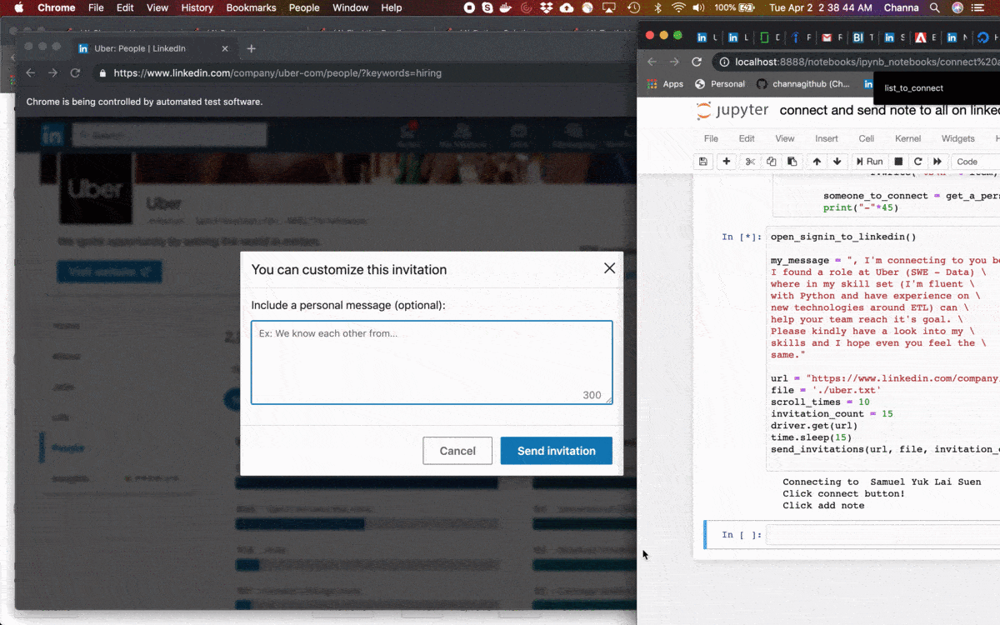

# send-connection-request-linkedin
Wanted to send connection requests to people who have put 'hiring' in their status (company wise). I have used Selenium and python.

Input: 
* input message
* company URL from linkedin, filtered by 'hiring' (Auto search will be implemented in next version)
* number of invitations to send

