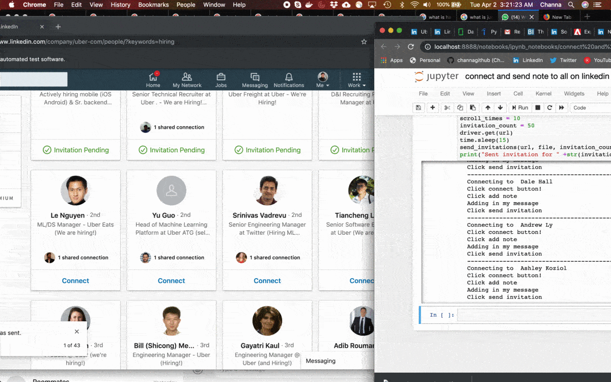

# send-connection-request-linkedin
Wanted to send connection requests to people who have put 'hiring' in their status (company wise). I have used Selenium and python.

Input: 
* input message
* company URL from linkedin, filtered by 'hiring' (Auto search will be implemented in next version)
* number of invitations to send

## Env to run this script (after cloning)
* Install selenium
* download chromedriver and update chromedriver path in utils.py
* update your linkedin email address and password in utils.py
* see an example in lookup_dict.py and update you messages
* $ python send_connection_request_on_linkedIn.py `company name` `number of invitations to send` `number of times to scroll when hiring members are not found`
* $ python send_connection_request_on_linkedIn.py ericsson 3 2